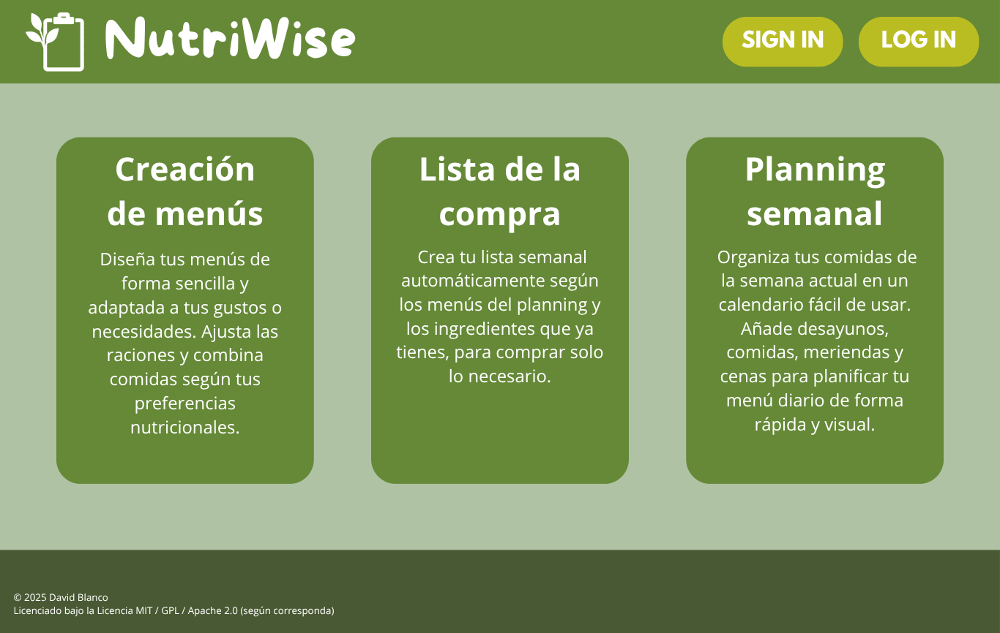

# NutriWise

- [Introducción](#introducción)
- [Estado de arte o análisis del contexto](#estado-de-arte-o-análisis-del-contexto)
- [Propósito](#propósito)
- [Objetivos](#objetivos)
- [Alcance](#alcance)
- [Funcionalidades del proyecto](#funcionalidades-del-proyecto)
- [Tipos de usuario](#tipos-de-usuario)
- [Modelo de negocio](#modelo-de-negocio)
- [Normativa aplicable](#normativa-aplicable)
- [Diseño](#diseño)
- [Planificacion da solución técnica](#planificacion-da-solución-técnica)
  - [Identificacion de fases](#identificacion-de-fases)
  - [Identificación de recursos](#identificación-de-recursos)
  - [Planificación temporal](#planificación-temporal)
  - [Presupuesto](#presupuesto)
- [Conclusiones](#conclusiones)
- [Referencias, Fuentes consultadas y Recursos externos: Webgrafía](#referencias-fuentes-consultadas-y-recursos-externos-webgrafía)

## Introducción

**NutriWise** es tu web de planificación de menús saludables. **NutriWise** ofrece la posibilidad de crear tus propios menús semanales según tus requerimientos nutricionales y cuenta con una lista de la compra automatizada que añadirá los productos necesarios para las recetas de los próximos días. Además la web cuenta con unos menús propios, ¡así que no tendrás que ni de que preocuparte de que vas a comer mañana!

## Estado de arte o análisis del contexto

Existen diversas aplicaciones móviles y webs de planificación de menús semanales por internet, aunque **NutriWise** tiene un enfoque ligeramente distinto. **NutriWise** busca ofrecer una planificación de menús a alguien que requiera unas caracteristicas nutricionales en concreto. Está pensado para deportistas, personas con dietas sin lípidos, veganos, personas con tratamiento onclógico y multitud de personas que necesiten unas necesidades nutricionales distintas a las de una persona normal. **NutrWise** pretende facilitar la vida de estas personas, donde muchas veces se encuentran en el problema de no saber que comer o cocinar porque están limitados por unos requerimientos nutricionales. Aunque por internet existen apps de seguimiento nutricional, la gran mayoría de estas son aplicaciones de pago o con micropagos inluídos. **NutriWise** tiene como objetivo realizar esto pero en un entorno gratuito, donde no tengas que econtrarte con pagos durante tu experiencia como usuario. **NutriWise** puede ser comercializada, ya que será lanzada como página web. Puede abrir una oportunidad de negocio, si establecemos subscripciones adicionales a la funcionalidad principal de la web o también si añadimos anuncios en nuestra web con Google AdSense.

## Propósito

El proyecto consiste en una webapp de planificación de menús semanales con una lista de la compra asociada a los menús. Además estos menús pueden incluir un seguimiento nutricional para las personas que así lo necesiten, es decir, llevará un contador de macronutrientes para así poder ajustar el menú que se crea a las necesidades nutricionales personales. Además la web tendrá ya preestrablecidos algunos menús, asi el usuario tampoco tiene la necesidad de pensar en crear unos menús. Por ejemplo, podemos ofrecer una serie de menús proteicos, menús bajos en sal, o menús bajos en lípidos.

## Objetivos

 - Crear menus completamente customizables por el usuario. Es decir, que el usuario pueda decidir que platos añade al menú, y que ingredientes poseen estos. Obligaremos al usuario a que mínimo un menú tenga un plato.
 - Tener una lista de la compra que se actualizará cada vez que el usuario marque "Compra finalizada", lo cual borrará la lista y hará un resumen de lo que se ha comprado. (Hasta se podría exportar este resumen a un archivo .txt).
 - Poder ver en forma de calendario semanal de tareas, que menus hay en cada dia para que el usuario vea que toca comer en cada momento del día.

## Alcance

La página web constará de una página principal de bienvenida donde se mostrarán los diferentes menús de la web. La creación de menús, el calendario semanal, la lista de la compra y el "recetario", que será donde estarán los menús preestablecidos de la web. La web tiene un login, que desbloqueará las funciones de la web. 

La web no incluye base de datos de alimentos para añadir a los menús. Tendrán que ser añadidos por el usuario, asi como la aportacion nutricional de cada uno. (Esto podría ser una implementación futura).

La aplicación se aplicará como una prueba de concepto.

## Funcionalidades del proyecto

- [ ] Login del Usuario. El usuario debe tener un login para poder guardar su progreso.
- [ ] Página de creación de menús. Debe dejar al usuario crear un menú de al menos un plato principal, entrante y postre seran opcionales.
- [ ] Página de seguimiento semanal. Será un calendario semanal donde el usuario puede añadir distintos menús a cada día para crear un planning semanal.
- [ ] Lista de la compra. Una lista de la compra que se creará a según los menús que se añadan al planning semanal.
- [ ] Página de menus preestrablecidos. Página en la que el usuario ya verá menus ya hechos y que podrá añadir al planning semanal sin necesidad de que él mismo tenga que crear el menú.

## Tipos de usuario

Esta aplicacion solo cuenta con un tipo de usuario, que será el usuario normal que se registre en la web. Solo necesitará proporcionar un correo electrónico y una contraseña para que pueda usar la aplicación, ya que obligaremos al usuario a registrarse o loguearse para poder usar la aplicación. Es decir, el usuario no podrá usar la web a menos que esté logueado.

## Modelo de negocio

La web estará basada en un modelo freemium ad-based, es decir, habrá anuncios (aunque intentaremos que sean lo menos molestos para el usuario) y la funcionalidad premium del control de seguimiento nutricional. Esta funcionalidad premium será de pago, una pequeña cantidad simbólica de 3,99€/año que nos permitirá tener unos ingresos mayores al modelo ad-based.

## Normativa aplicable

La web cumple con el Reglamento General de Proteccíon de Datos (RGPD): se informa a los usuarios sobre el uso de cookies y datos personales y se obtiene su consentimiento cuando corresponde.

Los ingresos procedentes de publicidad se declaran conforme a la normativa fiscal vigente en España.

Se adoptan medidas de seguridad informática para proteger la información y continuidad del servicio.

Se contempla la posibilidad de acceder a ayudas y subvenciones para proyectos digitales, de acuerdo con la normativa local y estatal.

## Diseño

Incluimos un mockup de la *landing page* que verá el usuario nada más aterrizar en nuestra web. 

Si el usuario quiere acceder a uno de estos menus de la web, una ventana modal con el login saltará para que se loguee o registre.

## Planificacion da solución técnica

### Identificacion de fases

El desarrollo de la web está dividido en las siguientes etapas:

1. Análisis y documentación.
   - Definir objetivos, alcance y funcionalidades.
   - Estudiar normativa, necesidades y público objetivo.
2. Diseño.
   - Diagramas E/R, UML, mockups de interfaz.
3. Desarrollo front-end.
4. Desarrollo backend.
   - Base de datos.
   - Conexion de base de datos con el front end
5. Pruebas y validación.
6. Despliegue y mantenimiento.

### Identificación de recursos

Humanos:
  - Un único desarrollador full stack que se encargará de hacer toda la aplicación.
  
Materiales y técnicos:
  - Ordenador y software de desarrollo.
  - Hosting web.
  - Base de Datos
  - Herramientas de diseño

### Planificación temporal

| Fase | Duración | Semana |
| --- | ---: | :---: |
| Análisis y documentación | 1 semana | 1 |
| Diseño | 2 semanas | 2-3 |
| Desarrollo front-end | 2 semanas | 4-5 |
| Desarrollo back-end | 2 semanas | 6-7 |
| Pruebas | 1 semana | 8 |
| Despliegue | 1 semana | 9 |

### Presupuesto

Los gastos de la web serían los siguientes.

| Concepto | Coste |
| --- | --- |
| Hosting y dominio | 50-100€ |
| Herramientas de diseño | 0€ |
| Software de desarrollo | 0€ |
| Publicidad | 0€ |
| **TOTAL ESTIMADO** | **50-100€** | 

## Conclusiones

> Deja esta apartado para el final. Realiza un resumen de todo lo que ha supuesto la realización de tu proyecto. Debe ser una redacción breve. Un resumen de los hitos conseguidos más importantes y de lo aprendido durante el proceso.
> Puede ser un buen punto de partida para organizar tu presentación y ajustarla al tiempo que tienes.

## Referencias, Fuentes consultadas y Recursos externos: Webgrafía

> *TODO*: Enlaces externos y descipciones de estos enlaces que creas conveniente indicar aquí. Generalmente ya van a estar integrados con tu documentación, pero si requieres realizar un listado de ellos, este es el lugar.
